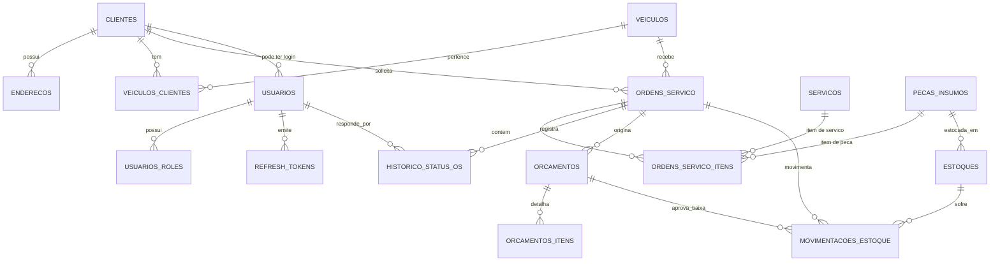

# Modelo de dados — W3

Documento da frente de dados da W3. O conteudo abaixo foi extraido do schema real,
aplicando as 19 migrations em ordem sobre um PostgreSQL 15 vazio e consultando o
catalogo (`information_schema` e `pg_catalog`). Nao ha aqui nenhuma afirmacao obtida
por leitura manual das migrations.

**Fonte:** `workshop-service-fase1`, migrations `V0.20260424213700` ate
`V0.20260912185705` (esta ultima e a migration de integridade da W3).

**Extraido em:** 2026-09-12 · 17 tabelas · 19 chaves estrangeiras · 56 indices.

---

## 1. Por que PostgreSQL

A escolha esta formalizada no [RFC-003](../rfc/RFC-003-database.md). Em resumo, o
dominio da oficina e fortemente relacional e transacional:

| Necessidade do dominio | O que o PostgreSQL entrega |
|---|---|
| Uma OS referencia cliente, veiculo, servicos e pecas; nenhum desses vinculos pode apontar para um registro inexistente | Chaves estrangeiras com `ON DELETE RESTRICT`, verificadas pelo banco e nao pela aplicacao |
| Aprovar um orcamento baixa estoque e muda o status da OS — as tres coisas valem juntas ou nenhuma | Transacoes ACID |
| Duas requisicoes simultaneas nao podem reservar a mesma peca | `SELECT ... FOR UPDATE` e advisory locks, ja usados no servico |
| Apenas um orcamento pendente por OS; placa unica apenas entre veiculos ativos | Indices unicos **parciais** (`WHERE ativo = TRUE`), que um indice unico comum nao expressa |
| Trilha de auditoria de transicoes de status | Tipos temporais nativos e integridade referencial do responsavel |

Um banco documental atenderia a escrita, mas moveria toda a integridade acima para
o codigo da aplicacao — exatamente o problema que a W3 corrige.

## 2. Diagrama entidade-relacionamento

Relacionamentos derivados das 19 FKs existentes no schema.



`WEBHOOK_EVENTOS_PROCESSADOS` nao aparece no diagrama por nao ter FK: e uma tabela de
idempotencia, chaveada pelo id do evento externo.

## 3. Relacionamentos e politica de remocao

As quatro FKs marcadas **(W3)** sao as criadas nesta onda.

| Origem | Coluna | Destino | ON DELETE | Leitura da regra |
|---|---|---|---|---|
| `ordens_servico` | `id_cliente` | `clientes` | **RESTRICT** (W3) | Nao se apaga cliente com historico de OS |
| `ordens_servico` | `id_veiculo` | `veiculos` | **RESTRICT** (W3) | Nao se apaga veiculo com historico de OS |
| `ordens_servico_itens` | `peca_insumo_id` | `pecas_insumos` | **RESTRICT** (W3) | Peca consumida permanece rastreavel |
| `historico_status_os` | `usuario_id` | `usuarios` | **RESTRICT** (W3) | Preserva a autoria da trilha de auditoria |
| `enderecos` | `cliente_id` | `clientes` | CASCADE | Endereco nao existe sem o cliente |
| `usuarios_roles` | `usuario_id` | `usuarios` | CASCADE | Papel nao existe sem o usuario |
| `refresh_tokens` | `usuario_id` | `usuarios` | CASCADE | Token nao existe sem o usuario |
| `usuarios` | `cliente_id` | `clientes` | RESTRICT | Login vinculado protege o cliente |
| `estoques` | `peca_insumo_id` | `pecas_insumos` | RESTRICT | Estoque referencia peca viva |
| `movimentacoes_estoque` | `estoque_id` | `estoques` | RESTRICT | Movimentacao e registro contabil |
| demais 9 FKs | — | — | NO ACTION | Vinculos internos de OS/orcamento, checados no fim da transacao |

A escolha entre `RESTRICT` e `CASCADE` segue uma regra unica: **dado de auditoria ou
rastreabilidade nunca desaparece por efeito colateral** (`RESTRICT`); dado que so existe
como parte de um agregado acompanha o pai (`CASCADE`).

### Identidade tecnica do webhook

A FK `fk_historico_status_os_usuarios` exige um responsavel existente para toda
transicao. Decisoes vindas do webhook de orcamento nao tem usuario humano, e versoes
anteriores gravavam um UUID novo a cada origem — deixando linhas orfas. A migration da
W3 resolve isso criando a conta `system.webhook`
(`70000000-0000-0000-0000-000000000001`), nao autenticavel por construcao
(`ativo=false`, `bloqueado=true`, hash sem credencial correspondente) e com o papel
`SISTEMA`, que nenhum endpoint autoriza. O historico legado foi reapontado para ela,
preservando a origem em `usuario_username`.

Consequencia operacional: essa conta e **invariante do schema**. Qualquer rotina que
limpe `usuarios` precisa recria-la — e o que faz a limpeza entre testes de integracao.

## 4. Revisao de performance

### Cobertura de indices nas chaves estrangeiras

Consulta ao `pg_catalog` procurando FKs cuja coluna de origem nao seja a primeira
coluna de algum indice:

```
FKs sem indice de suporte: 0 (de 19)
```

Isso importa porque o PostgreSQL **nao** cria indice automatico no lado de origem de uma
FK. Sem ele, cada `DELETE` ou `UPDATE` da chave no lado referenciado varre a tabela
filha inteira. As duas FKs que a W3 adicionou em tabelas de alto volume vieram
acompanhadas dos indices `ix_ordens_servico_itens_peca_insumo` e
`ix_historico_status_os_usuario` exatamente por isso.

### Indices que expressam regra de negocio

| Indice | Efeito |
|---|---|
| `ux_orcamentos_ordem_pendente` | Garante no maximo um orcamento pendente por OS |
| `ux_veiculos_placa_ativa` | Placa unica apenas entre veiculos ativos (parcial) |
| `uk_pecas_insumos_sku_ativo` | SKU unico apenas entre pecas ativas (parcial) |
| `ux_servicos_nome_ativo` | Nome de servico unico entre ativos (parcial) |
| `ux_ordens_servico_numero` | Numero da OS unico — chave publica usada em `/{numero}/status` |
| `uq_ordens_servico_itens_ordem` | Impede item duplicado na mesma OS |

Os indices parciais permitem reaproveitar placa, SKU ou nome apos remocao logica, sem
abrir mao da unicidade entre os registros vivos.

### Pontos a observar quando houver volume real

Sao observacoes, nao acoes pendentes da W3:

- `historico_status_os` cresce de forma monotonica; se a listagem por OS ficar lenta,
  o caminho e o indice composto ja existente `ix_historico_status_os_ordem_data`.
- `movimentacoes_estoque` tem o mesmo perfil de crescimento e ja possui indices por
  `estoque_id`, `ordem_servico_id` e `orcamento_id`.
- 56 indices sobre 17 tabelas encarecem a escrita. O numero e aceitavel para o volume
  do projeto, mas vale reavaliar caso a carga de escrita cresca.

## 5. Como reproduzir esta extracao

Sem AWS, com Docker local:

```bash
cd workshop-service-fase1
CID=$(docker run -d --rm -e POSTGRES_DB=erd -e POSTGRES_USER=erd \
  -e POSTGRES_PASSWORD=erd postgres:15-alpine)
for f in $(ls src/main/resources/db/migration/*.sql | sort -V); do
  docker exec -i "$CID" psql -U erd -d erd -v ON_ERROR_STOP=1 -q < "$f"
done
```

A prova automatizada equivalente e `DatabaseIntegrityMigrationIT`, que sobe o mesmo
PostgreSQL 15 via Testcontainers, roda Flyway do zero e valida FKs e indices.
